# Arquitectura del Microservicio BillingService - LogiFlow

## Índice
1. [Descripción General](#descripción-general)
2. [Estructura del Proyecto](#estructura-del-proyecto)
3. [Diagrama de Arquitectura](#diagrama-de-arquitectura)
4. [Configuración Principal](#configuración-principal)
5. [Capa de Datos (Entidades)](#capa-de-datos-entidades)
6. [DTOs y Validaciones](#dtos-y-validaciones)
7. [Capa de Negocio (Servicios)](#capa-de-negocio-servicios)
8. [Patrones de Diseño](#patrones-de-diseño)
9. [Controladores TCP](#controladores-tcp)
10. [Sistema de Eventos (RabbitMQ)](#sistema-de-eventos-rabbitmq)
11. [Módulo de Reportes](#módulo-de-reportes)
12. [Pruebas](#pruebas)
13. [Variables de Entorno](#variables-de-entorno)
14. [Diagramas de Flujo](#diagramas-de-flujo)

---

## Descripción General

El **BillingService** es responsable de la gestión completa del ciclo de facturación en LogiFlow, incluyendo:

- Cálculo dinámico de tarifas según tipo de entrega, vehículo y características del pedido
- Generación de facturas en estado BORRADOR, EMITIDA, PAGADA, CANCELADA y ANULADA
- Gestión de detalles de facturación con desgloses de costos
- Emisión de eventos de negocio para integración con otros microservicios
- Generación de reportes consolidados (diarios, por zona, por tipo de vehículo)

### Stack Tecnológico
- **Framework**: NestJS 10.x
- **ORM**: TypeORM 0.3.x
- **Base de Datos**: PostgreSQL 15+
- **Comunicación API Gateway**: TCP (MessagePattern)
- **Comunicación Inter-servicios**: RabbitMQ (EventPattern)
- **Validación**: class-validator, class-transformer

---

## Estructura del Proyecto

```
billing-service/
├── src/
│   ├── main.ts                                 # Punto de entrada
│   ├── app.module.ts                           # Módulo raíz
│   │
│   ├── config/                                 # Configuraciones
│   │   ├── database.config.ts
│   │   ├── rabbitmq.config.ts
│   │   └── app.config.ts
│   │
│   ├── common/                                 # Recursos compartidos
│   │   ├── constants/
│   │   │   ├── events.constants.ts
│   │   │   └── message-patterns.constants.ts
│   │   ├── decorators/
│   │   │   └── transactional.decorator.ts
│   │   ├── filters/
│   │   │   └── rpc-exception.filter.ts
│   │   ├── interceptors/
│   │   │   ├── logging.interceptor.ts
│   │   │   └── transform.interceptor.ts
│   │   └── interfaces/
│   │       ├── base-response.interface.ts
│   │       └── pagination.interface.ts
│   │
│   ├── modules/
│   │   │
│   │   ├── billing/                           # Módulo principal de facturación
│   │   │   ├── billing.module.ts
│   │   │   │
│   │   │   ├── controllers/
│   │   │   │   └── billing.controller.ts      # Controlador TCP
│   │   │   │
│   │   │   ├── services/
│   │   │   │   ├── billing.service.ts         # Lógica de negocio
│   │   │   │   ├── tariff-calculator.service.ts
│   │   │   │   └── invoice-generator.service.ts
│   │   │   │
│   │   │   ├── entities/
│   │   │   │   ├── factura.entity.ts
│   │   │   │   ├── tarifa.entity.ts
│   │   │   │   └── detalle-factura.entity.ts
│   │   │   │
│   │   │   ├── dto/
│   │   │   │   ├── create-factura.dto.ts
│   │   │   │   ├── update-factura.dto.ts
│   │   │   │   ├── calcular-tarifa.dto.ts
│   │   │   │   └── filtros-factura.dto.ts
│   │   │   │
│   │   │   ├── repositories/
│   │   │   │   ├── factura.repository.ts
│   │   │   │   └── tarifa.repository.ts
│   │   │   │
│   │   │   └── strategies/                    # Patrón Strategy
│   │   │       ├── tariff-strategy.interface.ts
│   │   │       ├── urban-tariff.strategy.ts
│   │   │       ├── intermunicipal-tariff.strategy.ts
│   │   │       └── national-tariff.strategy.ts
│   │   │
│   │   ├── events/                            # Módulo de eventos RabbitMQ
│   │   │   ├── events.module.ts
│   │   │   │
│   │   │   ├── consumers/                     # Consumidores de eventos
│   │   │   │   ├── pedido-events.consumer.ts
│   │   │   │   └── entrega-events.consumer.ts
│   │   │   │
│   │   │   ├── producers/                     # Productores de eventos
│   │   │   │   └── billing-events.producer.ts
│   │   │   │
│   │   │   └── dto/                          # DTOs de eventos
│   │   │       ├── pedido-creado.event.ts
│   │   │       ├── pedido-confirmado.event.ts
│   │   │       ├── pedido-cancelado.event.ts
│   │   │       ├── factura-generada.event.ts
│   │   │       ├── factura-emitida.event.ts
│   │   │       └── factura-anulada.event.ts
│   │   │
│   │   └── reports/                          # Módulo de reportes
│   │       ├── reports.module.ts
│   │       ├── services/
│   │       │   └── reports.service.ts
│   │       └── dto/
│   │           └── generate-report.dto.ts
│   │
│   └── database/
│       ├── migrations/                        # Migraciones TypeORM
│       │   └── 1234567890-InitialSchema.ts
│       └── seeds/                            # Datos iniciales
│           └── tarifa.seed.ts
│
├── test/                                     # Tests
│   ├── unit/
│   │   ├── billing.service.spec.ts
│   │   └── tariff-calculator.service.spec.ts
│   └── integration/
│       ├── billing.controller.spec.ts
│       └── events.consumer.spec.ts
│
├── .env.example
├── .eslintrc.js
├── .prettierrc
├── docker-compose.yml                        # Para desarrollo local
├── Dockerfile
├── nest-cli.json
├── package.json
├── tsconfig.json
└── README.md
```

---

## Diagrama de Arquitectura


---

## Configuración Principal

### main.ts

```typescript
import { NestFactory } from '@nestjs/core';
import { AppModule } from './app.module';
import { ValidationPipe, Logger } from '@nestjs/common';
import { Transport, MicroserviceOptions } from '@nestjs/microservices';
import { RpcExceptionFilter } from './common/filters/rpc-exception.filter';
import { LoggingInterceptor } from './common/interceptors/logging.interceptor';
import { TransformInterceptor } from './common/interceptors/transform.interceptor';

async function bootstrap() {
  const logger = new Logger('BillingService');
  const app = await NestFactory.create(AppModule);

  // ==========================================
  // MICROSERVICIO TCP - Comunicación con API Gateway
  // ==========================================
  app.connectMicroservice<MicroserviceOptions>({
    transport: Transport.TCP,
    options: {
      host: process.env.TCP_HOST || '0.0.0.0',
      port: parseInt(process.env.TCP_PORT) || 3004,
      retryAttempts: 5,
      retryDelay: 3000,
    },
  });

  // ==========================================
  // MICROSERVICIO RABBITMQ - Eventos entre servicios
  // ==========================================
  app.connectMicroservice<MicroserviceOptions>({
    transport: Transport.RMQ,
    options: {
      urls: [process.env.RABBITMQ_URL || 'amqp://localhost:5672'],
      queue: 'billing_queue',
      noAck: false, // ACK manual para garantizar procesamiento
      prefetchCount: 1, // Procesar un mensaje a la vez
      queueOptions: {
        durable: true, // La cola sobrevive a reinicios
        arguments: {
          'x-message-ttl': 86400000, // 24 horas
          'x-dead-letter-exchange': 'dlx.billing',
          'x-dead-letter-routing-key': 'billing.failed',
        },
      },
    },
  });

  // ==========================================
  // CONFIGURACIÓN GLOBAL
  // ==========================================
  app.useGlobalPipes(
    new ValidationPipe({
      transform: true,
      whitelist: true,
      forbidNonWhitelisted: true,
      transformOptions: {
        enableImplicitConversion: true,
      },
    }),
  );

  app.useGlobalFilters(new RpcExceptionFilter());
  app.useGlobalInterceptors(
    new LoggingInterceptor(),
    new TransformInterceptor(),
  );

  // ==========================================
  // INICIAR MICROSERVICIOS
  // ==========================================
  await app.startAllMicroservices();
  logger.log(`🚀 TCP Microservice listening on port ${process.env.TCP_PORT || 3004}`);
  logger.log(`🐰 RabbitMQ connected to billing_queue`);

  // ==========================================
  // SERVIDOR HTTP - Health checks y métricas
  // ==========================================
  const httpPort = parseInt(process.env.HTTP_PORT) || 3000;
  await app.listen(httpPort);
  logger.log(`💚 Health check endpoint on http://localhost:${httpPort}/health`);
}

bootstrap();
```

### app.module.ts

```typescript
import { Module } from '@nestjs/common';
import { ConfigModule, ConfigService } from '@nestjs/config';
import { TypeOrmModule } from '@nestjs/typeorm';
import { BillingModule } from './modules/billing/billing.module';
import { EventsModule } from './modules/events/events.module';
import { ReportsModule } from './modules/reports/reports.module';
import { databaseConfig } from './config/database.config';
import { rabbitmqConfig } from './config/rabbitmq.config';
import { appConfig } from './config/app.config';

@Module({
  imports: [
    // ==========================================
    // CONFIGURACIÓN GLOBAL
    // ==========================================
    ConfigModule.forRoot({
      isGlobal: true,
      load: [appConfig, databaseConfig, rabbitmqConfig],
      envFilePath: '.env',
    }),

    // ==========================================
    // TYPEORM CONFIGURACIÓN
    // ==========================================
    TypeOrmModule.forRootAsync({
      imports: [ConfigModule],
      inject: [ConfigService],
      useFactory: (configService: ConfigService) => ({
        type: 'postgres',
        host: configService.get('database.host'),
        port: configService.get('database.port'),
        username: configService.get('database.username'),
        password: configService.get('database.password'),
        database: configService.get('database.database'),
        entities: [__dirname + '/**/*.entity{.ts,.js}'],
        synchronize: configService.get('app.env') === 'development',
        logging: configService.get('database.logging'),
        migrations: [__dirname + '/database/migrations/*{.ts,.js}'],
        migrationsRun: true,
        ssl: configService.get('database.ssl')
          ? { rejectUnauthorized: false }
          : false,
      }),
    }),

    // ==========================================
    // MÓDULOS DE LA APLICACIÓN
    // ==========================================
    BillingModule,
    EventsModule,
    ReportsModule,
  ],
})
export class AppModule {}
```

### config/database.config.ts

```typescript
import { registerAs } from '@nestjs/config';

export const databaseConfig = registerAs('database', () => ({
  host: process.env.DB_HOST || 'localhost',
  port: parseInt(process.env.DB_PORT, 10) || 5432,
  username: process.env.DB_USERNAME || 'postgres',
  password: process.env.DB_PASSWORD || 'postgres',
  database: process.env.DB_NAME || 'billing_db',
  logging: process.env.DB_LOGGING === 'true',
  ssl: process.env.DB_SSL === 'true',
}));

export default databaseConfig;
```

### config/rabbitmq.config.ts

```typescript
import { registerAs } from '@nestjs/config';

export const rabbitmqConfig = registerAs('rabbitmq', () => ({
  url: process.env.RABBITMQ_URL || 'amqp://localhost:5672',
  queue: process.env.RABBITMQ_QUEUE || 'billing_queue',
  exchangeName: process.env.RABBITMQ_EXCHANGE || 'logiflow.events',
  prefetchCount: parseInt(process.env.RABBITMQ_PREFETCH_COUNT, 10) || 1,
}));

export default rabbitmqConfig;
```

### config/app.config.ts

```typescript
import { registerAs } from '@nestjs/config';

export const appConfig = registerAs('app', () => ({
  env: process.env.NODE_ENV || 'development',
  port: parseInt(process.env.PORT, 10) || 3000,
  tcpPort: parseInt(process.env.TCP_PORT, 10) || 3004,
  serviceName: 'billing-service',
  version: process.env.npm_package_version || '1.0.0',
}));

export default appConfig;
```

---

## Capa de Datos (Entidades)

### entities/factura.entity.ts

```typescript
import {
  Entity,
  PrimaryGeneratedColumn,
  Column,
  CreateDateColumn,
  UpdateDateColumn,
  OneToMany,
  Index,
} from 'typeorm';
import { DetalleFactura } from './detalle-factura.entity';

export enum EstadoFactura {
  BORRADOR = 'BORRADOR',
  EMITIDA = 'EMITIDA',
  PAGADA = 'PAGADA',
  CANCELADA = 'CANCELADA',
  ANULADA = 'ANULADA',
}

export enum TipoPago {
  EFECTIVO = 'EFECTIVO',
  TARJETA = 'TARJETA',
  TRANSFERENCIA = 'TRANSFERENCIA',
  CREDITO = 'CREDITO',
}

@Entity('facturas')
@Index(['pedidoId'])
@Index(['clienteId'])
@Index(['estado'])
@Index(['createdAt'])
export class Factura {
  @PrimaryGeneratedColumn('uuid')
  id: string;

  @Column({ unique: true, length: 50 })
  @Index()
  numeroFactura: string;

  @Column({ type: 'uuid' })
  pedidoId: string;

  @Column({ type: 'uuid' })
  clienteId: string;

  @Column({ length: 200 })
  clienteNombre: string;

  @Column({ nullable: true, length: 13 })
  clienteRuc: string;

  @Column({ nullable: true, length: 500 })
  clienteDireccion: string;

  @Column({ type: 'uuid', nullable: true })
  zonaId: string;

  @Column({ nullable: true, length: 100 })
  zonaNombre: string;

  @Column({
    type: 'enum',
    enum: EstadoFactura,
    default: EstadoFactura.BORRADOR,
  })
  estado: EstadoFactura;

  @Column({ type: 'decimal', precision: 10, scale: 2 })
  subtotal: number;

  @Column({ type: 'decimal', precision: 10, scale: 2, default: 0 })
  descuento: number;

  @Column({ type: 'decimal', precision: 10, scale: 2 })
  iva: number;

  @Column({ type: 'decimal', precision: 5, scale: 2, default: 12.0 })
  porcentajeIva: number;

  @Column({ type: 'decimal', precision: 10, scale: 2 })
  total: number;

  @Column({ type: 'enum', enum: TipoPago, nullable: true })
  tipoPago: TipoPago;

  @Column({ type: 'timestamp', nullable: true })
  fechaPago: Date;

  @Column({ nullable: true, length: 100 })
  referenciaPago: string;

  @Column({ type: 'text', nullable: true })
  observaciones: string;

  @Column({ type: 'jsonb', nullable: true })
  metadata: Record<string, any>;

  @OneToMany(() => DetalleFactura, (detalle) => detalle.factura, {
    cascade: true,
    eager: true,
  })
  detalles: DetalleFactura[];

  @CreateDateColumn()
  createdAt: Date;

  @UpdateDateColumn()
  updatedAt: Date;

  @Column({ type: 'timestamp', nullable: true })
  deletedAt: Date;
}
```

### entities/tarifa.entity.ts

```typescript
import {
  Entity,
  PrimaryGeneratedColumn,
  Column,
  CreateDateColumn,
  UpdateDateColumn,
  Index,
} from 'typeorm';

export enum TipoEntrega {
  URBANA = 'URBANA',
  INTERMUNICIPAL = 'INTERMUNICIPAL',
  NACIONAL = 'NACIONAL',
}

export enum TipoVehiculo {
  MOTORIZADO = 'MOTORIZADO',
  VEHICULO_LIVIANO = 'VEHICULO_LIVIANO',
  CAMION = 'CAMION',
}

@Entity('tarifas')
@Index(['tipoEntrega', 'tipoVehiculo', 'activa'])
export class Tarifa {
  @PrimaryGeneratedColumn('uuid')
  id: string;

  @Column({ type: 'enum', enum: TipoEntrega })
  tipoEntrega: TipoEntrega;

  @Column({ type: 'enum', enum: TipoVehiculo })
  tipoVehiculo: TipoVehiculo;

  @Column({ length: 100 })
  nombre: string;

  @Column({ type: 'text', nullable: true })
  descripcion: string;

  // ==========================================
  // COSTOS BASE
  // ==========================================
  @Column({ type: 'decimal', precision: 10, scale: 2 })
  tarifaBase: number;

  @Column({ type: 'decimal', precision: 10, scale: 2, default: 0 })
  costoPorKm: number;

  @Column({ type: 'decimal', precision: 10, scale: 2, default: 0 })
  costoPorKg: number;

  @Column({ type: 'decimal', precision: 10, scale: 2, default: 0 })
  costoMinimo: number;

  // ==========================================
  // RECARGOS Y AJUSTES
  // ==========================================
  @Column({ type: 'decimal', precision: 10, scale: 2, nullable: true })
  tarifaUrgente: number;

  @Column({ type: 'decimal', precision: 5, scale: 2, nullable: true })
  factorZona: number;

  @Column({ type: 'decimal', precision: 5, scale: 2, default: 0 })
  porcentajeDescuentoVolumen: number;

  // ==========================================
  // CONFIGURACIÓN
  // ==========================================
  @Column({ type: 'int', nullable: true })
  kmIncluidos: number; // Ej: primeros 5 km incluidos

  @Column({ type: 'int', nullable: true })
  kgIncluidos: number; // Ej: primeros 10 kg incluidos

  @Column({ type: 'boolean', default: true })
  activa: boolean;

  @Column({ type: 'timestamp', nullable: true })
  validaDesde: Date;

  @Column({ type: 'timestamp', nullable: true })
  validaHasta: Date;

  @CreateDateColumn()
  createdAt: Date;

  @UpdateDateColumn()
  updatedAt: Date;
}
```

### entities/detalle-factura.entity.ts

```typescript
import {
  Entity,
  PrimaryGeneratedColumn,
  Column,
  ManyToOne,
  JoinColumn,
} from 'typeorm';
import { Factura } from './factura.entity';

@Entity('detalle_facturas')
export class DetalleFactura {
  @PrimaryGeneratedColumn('uuid')
  id: string;

  @Column({ type: 'uuid' })
  facturaId: string;

  @ManyToOne(() => Factura, (factura) => factura.detalles, {
    onDelete: 'CASCADE',
  })
  @JoinColumn({ name: 'facturaId' })
  factura: Factura;

  @Column({ type: 'int', default: 1 })
  orden: number;

  @Column({ length: 200 })
  concepto: string;

  @Column({ type: 'text', nullable: true })
  descripcion: string;

  @Column({ type: 'decimal', precision: 10, scale: 3, default: 1 })
  cantidad: number;

  @Column({ length: 20, default: 'UNIDAD' })
  unidadMedida: string;

  @Column({ type: 'decimal', precision: 10, scale: 2 })
  precioUnitario: number;

  @Column({ type: 'decimal', precision: 10, scale: 2 })
  subtotal: number;

  @Column({ type: 'decimal', precision: 5, scale: 2, default: 0 })
  porcentajeDescuento: number;

  @Column({ type: 'decimal', precision: 10, scale: 2, default: 0 })
  descuento: number;

  @Column({ type: 'decimal', precision: 10, scale: 2 })
  total: number;

  @Column({ type: 'jsonb', nullable: true })
  metadata: Record<string, any>;
}
```

---

## DTOs y Validaciones

### dto/create-factura.dto.ts

```typescript
import {
  IsUUID,
  IsString,
  IsEnum,
  IsNumber,
  IsBoolean,
  IsOptional,
  Min,
  Max,
  Length,
} from 'class-validator';
import { TipoEntrega, TipoVehiculo } from '../entities/tarifa.entity';

export class CreateFacturaDto {
  @IsUUID()
  pedidoId: string;

  @IsUUID()
  clienteId: string;

  @IsString()
  @Length(1, 200)
  clienteNombre: string;

  @IsOptional()
  @IsString()
  @Length(10, 13)
  clienteRuc?: string;

  @IsOptional()
  @IsString()
  @Length(1, 500)
  clienteDireccion?: string;

  @IsEnum(TipoEntrega)
  tipoEntrega: TipoEntrega;

  @IsEnum(TipoVehiculo)
  tipoVehiculo: TipoVehiculo;

  @IsNumber()
  @Min(0)
  @Max(10000)
  distanciaKm: number;

  @IsNumber()
  @Min(0)
  @Max(50000)
  pesoKg: number;

  @IsBoolean()
  esUrgente: boolean;

  @IsOptional()
  @IsUUID()
  zonaId?: string;

  @IsOptional()
  @IsString()
  zonaNombre?: string;
}
```

### dto/update-factura.dto.ts

```typescript
import { IsEnum, IsString, IsOptional, Length } from 'class-validator';
import { TipoPago } from '../entities/factura.entity';

export class UpdateFacturaDto {
  @IsOptional()
  @IsEnum(TipoPago)
  tipoPago?: TipoPago;

  @IsOptional()
  @IsString()
  @Length(1, 100)
  referenciaPago?: string;

  @IsOptional()
  @IsString()
  observaciones?: string;
}
```

### dto/calcular-tarifa.dto.ts

```typescript
import {
  IsEnum,
  IsNumber,
  IsBoolean,
  IsOptional,
  IsUUID,
  Min,
  Max,
} from 'class-validator';
import { TipoEntrega, TipoVehiculo } from '../entities/tarifa.entity';

export class CalcularTarifaDto {
  @IsEnum(TipoEntrega)
  tipoEntrega: TipoEntrega;

  @IsEnum(TipoVehiculo)
  tipoVehiculo: TipoVehiculo;

  @IsNumber()
  @Min(0)
  @Max(10000)
  distanciaKm: number;

  @IsNumber()
  @Min(0)
  @Max(50000)
  pesoKg: number;

  @IsBoolean()
  esUrgente: boolean;

  @IsOptional()
  @IsUUID()
  zonaId?: string;
}
```

### dto/filtros-factura.dto.ts

```typescript
import { IsOptional, IsEnum, IsUUID, IsDateString } from 'class-validator';
import { EstadoFactura } from '../entities/factura.entity';
import { Type } from 'class-transformer';

export class FiltrosFacturaDto {
  @IsOptional()
  @IsEnum(EstadoFactura)
  estado?: EstadoFactura;

  @IsOptional()
  @IsUUID()
  clienteId?: string;

  @IsOptional()
  @IsUUID()
  zonaId?: string;

  @IsOptional()
  @IsDateString()
  fechaDesde?: string;

  @IsOptional()
  @IsDateString()
  fechaHasta?: string;

  @IsOptional()
  @Type(() => Number)
  page?: number = 1;

  @IsOptional()
  @Type(() => Number)
  limit?: number = 10;
}
```

---

## Capa de Negocio (Servicios)

### services/billing.service.ts

```typescript
import { Injectable, NotFoundException, BadRequestException } from '@nestjs/common';
import { InjectRepository } from '@nestjs/typeorm';
import { Repository, Between } from 'typeorm';
import { Factura, EstadoFactura, TipoPago } from '../entities/factura.entity';
import { TariffCalculatorService } from './tariff-calculator.service';
import { InvoiceGeneratorService } from './invoice-generator.service';
import { CreateFacturaDto } from '../dto/create-factura.dto';
import { UpdateFacturaDto } from '../dto/update-factura.dto';
import { FiltrosFacturaDto } from '../dto/filtros-factura.dto';

@Injectable()
export class BillingService {
  constructor(
    @InjectRepository(Factura)
    private readonly facturaRepository: Repository<Factura>,
    private readonly tariffCalculator: TariffCalculatorService,
    private readonly invoiceGenerator: InvoiceGeneratorService,
  ) {}

  /**
   * Crear factura en estado BORRADOR
   * Transacción ACID local
   */
  async createFacturaBorrador(createDto: CreateFacturaDto): Promise<Factura> {
    // Validar que no exista factura para este pedido
    const facturaExistente = await this.facturaRepository.findOne({
      where: { pedidoId: createDto.pedidoId },
    });

    if (facturaExistente) {
      throw new BadRequestException(
        `Ya existe una factura para el pedido ${createDto.pedidoId}`,
      );
    }

    // Calcular tarifa utilizando el servicio especializado
    const calculoTarifa = await this.tariffCalculator.calcularTarifa({
      tipoEntrega: createDto.tipoEntrega,
      tipoVehiculo: createDto.tipoVehiculo,
      distanciaKm: createDto.distanciaKm,
      pesoKg: createDto.pesoKg,
      esUrgente: createDto.esUrgente,
      zonaId: createDto.zonaId,
    });

    // Generar número de factura único
    const numeroFactura = await this.generarNumeroFactura();

    // Crear entidad de factura
    const factura = this.facturaRepository.create({
      numeroFactura,
      pedidoId: createDto.pedidoId,
      clienteId: createDto.clienteId,
      clienteNombre: createDto.clienteNombre,
      clienteRuc: createDto.clienteRuc,
      clienteDireccion: createDto.clienteDireccion,
      zonaId: createDto.zonaId,
      zonaNombre: createDto.zonaNombre,
      estado: EstadoFactura.BORRADOR,
      subtotal: calculoTarifa.subtotal,
      descuento: calculoTarifa.descuento,
      iva: calculoTarifa.iva,
      porcentajeIva: 12.0,
      total: calculoTarifa.total,
      detalles: calculoTarifa.detalles,
      metadata: calculoTarifa.breakdown,
    });

    // Guardar con transacción ACID
    return await this.facturaRepository.save(factura);
  }

  /**
   * Obtener factura por ID
   */
  async findById(id: string): Promise<Factura> {
    const factura = await this.facturaRepository.findOne({
      where: { id },
      relations: ['detalles'],
    });

    if (!factura) {
      throw new NotFoundException(`Factura con ID ${id} no encontrada`);
    }

    return factura;
  }

  /**
   * Obtener factura por ID de pedido
   */
  async findByPedidoId(pedidoId: string): Promise<Factura> {
    const factura = await this.facturaRepository.findOne({
      where: { pedidoId },
      relations: ['detalles'],
    });

    if (!factura) {
      throw new NotFoundException(
        `Factura para pedido ${pedidoId} no encontrada`,
      );
    }

    return factura;
  }

  /**
   * Listar facturas con filtros y paginación
   */
  async findAll(filtros: FiltrosFacturaDto) {
    const { page = 1, limit = 10, ...where } = filtros;
    const skip = (page - 1) * limit;

    // Construir query dinámico
    const queryBuilder = this.facturaRepository
      .createQueryBuilder('factura')
      .leftJoinAndSelect('factura.detalles', 'detalles')
      .orderBy('factura.createdAt', 'DESC');

    if (where.estado) {
      queryBuilder.andWhere('factura.estado = :estado', { estado: where.estado });
    }

    if (where.clienteId) {
      queryBuilder.andWhere('factura.clienteId = :clienteId', {
        clienteId: where.clienteId,
      });
    }

    if (where.zonaId) {
      queryBuilder.andWhere('factura.zonaId = :zonaId', { zonaId: where.zonaId });
    }

    if (where.fechaDesde && where.fechaHasta) {
      queryBuilder.andWhere('factura.createdAt BETWEEN :fechaDesde AND :fechaHasta', {
        fechaDesde: where.fechaDesde,
        fechaHasta: where.fechaHasta,
      });
    }

    const [facturas, total] = await queryBuilder
      .skip(skip)
      .take(limit)
      .getManyAndCount();

    return {
      data: facturas,
      meta: {
        total,
        page,
        limit,
        totalPages: Math.ceil(total / limit),
      },
    };
  }

  /**
   * Emitir factura (cambiar de BORRADOR a EMITIDA)
   * Transacción ACID
   */
  async emitirFactura(id: string): Promise<Factura> {
    const factura = await this.findById(id);

    if (factura.estado !== EstadoFactura.BORRADOR) {
      throw new BadRequestException(
        'Solo se pueden emitir facturas en estado BORRADOR',
      );
    }

    factura.estado = EstadoFactura.EMITIDA;
    return await this.facturaRepository.save(factura);
  }

  /**
   * Registrar pago de factura
   * Transacción ACID
   */
  async registrarPago(
    id: string,
    updateDto: UpdateFacturaDto,
  ): Promise<Factura> {
    const factura = await this.findById(id);

    if (factura.estado !== EstadoFactura.EMITIDA) {
      throw new BadRequestException('Solo se pueden pagar facturas emitidas');
    }

    factura.estado = EstadoFactura.PAGADA;
    factura.tipoPago = updateDto.tipoPago;
    factura.fechaPago = new Date();
    factura.referenciaPago = updateDto.referenciaPago;
    factura.observaciones = updateDto.observaciones;

    return await this.facturaRepository.save(factura);
  }

  /**
   * Anular factura
   * Transacción ACID
   */
  async anularFactura(id: string, motivo: string): Promise<Factura> {
    const factura = await this.findById(id);

    if (factura.estado === EstadoFactura.PAGADA) {
      throw new BadRequestException('No se puede anular una factura pagada');
    }

    factura.estado = EstadoFactura.ANULADA;
    factura.observaciones = `ANULADA: ${motivo}`;

    return await this.facturaRepository.save(factura);
  }

  /**
   * Obtener reporte diario de facturación
   */
  async getReporteDiario(fecha: Date, zonaId?: string) {
    const inicioDia = new Date(fecha);
    inicioDia.setHours(0, 0, 0, 0);

    const finDia = new Date(fecha);
    finDia.setHours(23, 59, 59, 999);

    const query = this.facturaRepository
      .createQueryBuilder('factura')
      .where('factura.createdAt BETWEEN :inicio AND :fin', {
        inicio: inicioDia,
        fin: finDia,
      });

    if (zonaId) {
      query.andWhere('factura.zonaId = :zonaId', { zonaId });
    }

    const facturas = await query.getMany();

    // Calcular estadísticas
    const totalFacturado = facturas.reduce(
      (sum, f) => sum + Number(f.total),
      0,
    );

    const totalPagado = facturas
      .filter((f) => f.estado === EstadoFactura.PAGADA)
      .reduce((sum, f) => sum + Number(f.total), 0);

    const totalPendiente = facturas
      .filter((f) => f.estado === EstadoFactura.EMITIDA)
      .reduce((sum, f) => sum + Number(f.total), 0);

    return {
      fecha,
      zonaId,
      resumen: {
        cantidadTotal: facturas.length,
        cantidadBorrador: facturas.filter((f) => f.estado === EstadoFactura.BORRADOR).length,
        cantidadEmitida: facturas.filter((f) => f.estado === EstadoFactura.EMITIDA).length,
        cantidadPagada: facturas.filter((f) => f.estado === EstadoFactura.PAGADA).length,
        cantidadAnulada: facturas.filter((f) => f.estado === EstadoFactura.ANULADA).length,
        totalFacturado,
        totalPagado,
        totalPendiente,
        pendienteCobro: totalFacturado - totalPagado,
      },
      facturas,
    };
  }

  /**
   * Generar número de factura único
   * Formato: F-YYYYMM-XXXXXX
   */
  private async generarNumeroFactura(): Promise<string> {
    const fecha = new Date();
    const año = fecha.getFullYear();
    const mes = String(fecha.getMonth() + 1).padStart(2, '0');
    const prefijo = `F-${año}${mes}`;

    // Obtener última factura del mes
    const ultimaFactura = await this.facturaRepository
      .createQueryBuilder('factura')
      .where('factura.numeroFactura LIKE :prefijo', { prefijo: `${prefijo}-%` })
      .orderBy('factura.numeroFactura', 'DESC')
      .getOne();

    let secuencial = 1;
    if (ultimaFactura) {
      const ultimoNumero = ultimaFactura.numeroFactura.split('-')[2];
      secuencial = parseInt(ultimoNumero, 10) + 1;
    }

    return `${prefijo}-${String(secuencial).padStart(6, '0')}`;
  }
}
```

### services/tariff-calculator.service.ts

```typescript
import { Injectable, NotFoundException } from '@nestjs/common';
import { InjectRepository } from '@nestjs/typeorm';
import { Repository } from 'typeorm';
import { Tarifa, TipoEntrega, TipoVehiculo } from '../entities/tarifa.entity';
import { CalcularTarifaDto } from '../dto/calcular-tarifa.dto';
import { TariffStrategy } from '../strategies/tariff-strategy.interface';
import { UrbanTariffStrategy } from '../strategies/urban-tariff.strategy';
import { IntermunicipalTariffStrategy } from '../strategies/intermunicipal-tariff.strategy';
import { NationalTariffStrategy } from '../strategies/national-tariff.strategy';

@Injectable()
export class TariffCalculatorService {
  private strategies: Map<TipoEntrega, TariffStrategy>;

  constructor(
    @InjectRepository(Tarifa)
    private readonly tarifaRepository: Repository<Tarifa>,
    private readonly urbanStrategy: UrbanTariffStrategy,
    private readonly intermunicipalStrategy: IntermunicipalTariffStrategy,
    private readonly nationalStrategy: NationalTariffStrategy,
  ) {
    // Patrón Strategy: Registro de estrategias de cálculo
    this.strategies = new Map([
      [TipoEntrega.URBANA, this.urbanStrategy],
      [TipoEntrega.INTERMUNICIPAL, this.intermunicipalStrategy],
      [TipoEntrega.NACIONAL, this.nationalStrategy],
    ]);
  }

  /**
   * Calcular tarifa según tipo de entrega
   * Utiliza patrón Strategy
   */
  async calcularTarifa(dto: CalcularTarifaDto) {
    // Obtener tarifa base del catálogo
    const tarifa = await this.obtenerTarifa(dto.tipoEntrega, dto.tipoVehiculo);

    // Seleccionar estrategia según tipo de entrega
    const strategy = this.strategies.get(dto.tipoEntrega);
    if (!strategy) {
      throw new NotFoundException(
        `Estrategia no encontrada para ${dto.tipoEntrega}`,
      );
    }

    // Calcular usando la estrategia correspondiente
    const calculo = strategy.calcular(tarifa, dto);

    // Calcular IVA (12% en Ecuador)
    const iva = calculo.subtotal * 0.12;
    const total = calculo.subtotal + iva - calculo.descuento;

    return {
      subtotal: Number(calculo.subtotal.toFixed(2)),
      descuento: Number(calculo.descuento.toFixed(2)),
      iva: Number(iva.toFixed(2)),
      total: Number(total.toFixed(2)),
      detalles: calculo.detalles,
      breakdown: calculo.breakdown,
    };
  }

  /**
   * Obtener tarifa activa del catálogo
   */
  private async obtenerTarifa(
    tipoEntrega: TipoEntrega,
    tipoVehiculo: TipoVehiculo,
  ): Promise<Tarifa> {
    const tarifa = await this.tarifaRepository.findOne({
      where: {
        tipoEntrega,
        tipoVehiculo,
        activa: true,
      },
    });

    if (!tarifa) {
      throw new NotFoundException(
        `Tarifa no encontrada para ${tipoEntrega} - ${tipoVehiculo}`,
      );
    }

    // Validar vigencia
    const ahora = new Date();
    if (tarifa.validaDesde && tarifa.validaDesde > ahora) {
      throw new NotFoundException('Tarifa aún no vigente');
    }
    if (tarifa.validaHasta && tarifa.validaHasta < ahora) {
      throw new NotFoundException('Tarifa ya no vigente');
    }

    return tarifa;
  }
}
```

### services/invoice-generator.service.ts

```typescript
import { Injectable } from '@nestjs/common';
import { Factura } from '../entities/factura.entity';

@Injectable()
export class InvoiceGeneratorService {
  /**
   * Generar XML de factura electrónica (SRI Ecuador)
   */
  async generarXML(factura: Factura): Promise<string> {
    // Implementación futura: generar XML según formato SRI
    return `<?xml version="1.0" encoding="UTF-8"?>
    <factura id="${factura.numeroFactura}">
      <infoTributaria>
        <ruc>1234567890001</ruc>
        <razonSocial>EntregaExpress S.A.</razonSocial>
      </infoTributaria>
      <infoFactura>
        <numeroFactura>${factura.numeroFactura}</numeroFactura>
        <cliente>${factura.clienteNombre}</cliente>
        <totalSinImpuestos>${factura.subtotal}</totalSinImpuestos>
        <totalConImpuestos>${factura.total}</totalConImpuestos>
      </infoFactura>
    </factura>`;
  }

  /**
   * Generar PDF de factura
   */
  async generarPDF(factura: Factura): Promise<Buffer> {
    // Implementación futura: usar pdfkit o puppeteer
    return Buffer.from('PDF placeholder');
  }

  /**
   * Enviar factura por correo electrónico
   */
  async enviarPorEmail(factura: Factura, email: string): Promise<void> {
    // Implementación futura: integrar con servicio de email
    console.log(`Enviando factura ${factura.numeroFactura} a ${email}`);
  }
}
```

---

## Patrones de Diseño

### Patrón Strategy - Cálculo de Tarifas

#### strategies/tariff-strategy.interface.ts

```typescript
import { Tarifa } from '../entities/tarifa.entity';
import { CalcularTarifaDto } from '../dto/calcular-tarifa.dto';

export interface CalculoResult {
  subtotal: number;
  descuento: number;
  detalles: Array<{
    concepto: string;
    descripcion: string;
    cantidad: number;
    precioUnitario: number;
    subtotal: number;
    descuento: number;
    total: number;
  }>;
  breakdown: {
    tarifaBase: number;
    costoPorKm?: number;
    costoPorKg?: number;
    recargoUrgencia?: number;
    factorZona?: number;
    descuentoAplicado?: number;
  };
}

export interface TariffStrategy {
  calcular(tarifa: Tarifa, dto: CalcularTarifaDto): CalculoResult;
}
```

#### strategies/urban-tariff.strategy.ts

```typescript
import { Injectable } from '@nestjs/common';
import { TariffStrategy, CalculoResult } from './tariff-strategy.interface';
import { Tarifa } from '../entities/tarifa.entity';
import { CalcularTarifaDto } from '../dto/calcular-tarifa.dto';

/**
 * Estrategia de cálculo para entregas urbanas (última milla)
 * - Tarifa base + costo por km adicional (más de 5 km)
 * - Recargo por urgencia
 */
@Injectable()
export class UrbanTariffStrategy implements TariffStrategy {
  calcular(tarifa: Tarifa, dto: CalcularTarifaDto): CalculoResult {
    let subtotal = Number(tarifa.tarifaBase);
    const breakdown: any = {
      tarifaBase: Number(tarifa.tarifaBase),
    };

    // Costo por kilómetro (solo si excede los km incluidos)
    const kmIncluidos = tarifa.kmIncluidos || 5;
    const kmAdicionales = Math.max(0, dto.distanciaKm - kmIncluidos);
    const costoPorKm = kmAdicionales * Number(tarifa.costoPorKm);

    if (costoPorKm > 0) {
      subtotal += costoPorKm;
      breakdown.costoPorKm = costoPorKm;
    }

    // Recargo por urgencia (tarifa plana)
    if (dto.esUrgente && tarifa.tarifaUrgente) {
      const recargoUrgencia = Number(tarifa.tarifaUrgente);
      subtotal += recargoUrgencia;
      breakdown.recargoUrgencia = recargoUrgencia;
    }

    // Aplicar costo mínimo si aplica
    if (tarifa.costoMinimo && subtotal < Number(tarifa.costoMinimo)) {
      subtotal = Number(tarifa.costoMinimo);
      breakdown.costoMinimoAplicado = true;
    }

    // Crear detalle de factura
    const detalles = [
      {
        concepto: 'Servicio de entrega urbana',
        descripcion: `${dto.tipoVehiculo} - ${dto.distanciaKm} km${dto.esUrgente ? ' (URGENTE)' : ''}`,
        cantidad: 1,
        precioUnitario: subtotal,
        subtotal,
        descuento: 0,
        total: subtotal,
      },
    ];

    return {
      subtotal,
      descuento: 0,
      detalles,
      breakdown,
    };
  }
}
```

#### strategies/intermunicipal-tariff.strategy.ts

```typescript
import { Injectable } from '@nestjs/common';
import { TariffStrategy, CalculoResult } from './tariff-strategy.interface';
import { Tarifa } from '../entities/tarifa.entity';
import { CalcularTarifaDto } from '../dto/calcular-tarifa.dto';

/**
 * Estrategia de cálculo para entregas intermunicipales
 * - Tarifa base + costo por km + costo por kg
 * - Factor de zona
 */
@Injectable()
export class IntermunicipalTariffStrategy implements TariffStrategy {
  calcular(tarifa: Tarifa, dto: CalcularTarifaDto): CalculoResult {
    let subtotal = Number(tarifa.tarifaBase);
    const breakdown: any = {
      tarifaBase: Number(tarifa.tarifaBase),
    };

    // Costo por kilómetro
    const kmIncluidos = tarifa.kmIncluidos || 0;
    const kmAdicionales = Math.max(0, dto.distanciaKm - kmIncluidos);
    const costoPorKm = kmAdicionales * Number(tarifa.costoPorKm);

    if (costoPorKm > 0) {
      subtotal += costoPorKm;
      breakdown.costoPorKm = costoPorKm;
    }

    // Costo por kilogramo
    const kgIncluidos = tarifa.kgIncluidos || 10;
    const kgAdicionales = Math.max(0, dto.pesoKg - kgIncluidos);
    const costoPorKg = kgAdicionales * Number(tarifa.costoPorKg);

    if (costoPorKg > 0) {
      subtotal += costoPorKg;
      breakdown.costoPorKg = costoPorKg;
    }

    // Factor de zona (multiplicador)
    if (tarifa.factorZona && tarifa.factorZona > 0) {
      const factorZona = Number(tarifa.factorZona);
      subtotal *= factorZona;
      breakdown.factorZona = factorZona;
    }

    // Recargo por urgencia
    if (dto.esUrgente && tarifa.tarifaUrgente) {
      const recargoUrgencia = Number(tarifa.tarifaUrgente);
      subtotal += recargoUrgencia;
      breakdown.recargoUrgencia = recargoUrgencia;
    }

    // Aplicar costo mínimo
    if (tarifa.costoMinimo && subtotal < Number(tarifa.costoMinimo)) {
      subtotal = Number(tarifa.costoMinimo);
      breakdown.costoMinimoAplicado = true;
    }

    const detalles = [
      {
        concepto: 'Servicio de entrega intermunicipal',
        descripcion: `${dto.tipoVehiculo} - ${dto.distanciaKm} km, ${dto.pesoKg} kg${dto.esUrgente ? ' (URGENTE)' : ''}`,
        cantidad: 1,
        precioUnitario: subtotal,
        subtotal,
        descuento: 0,
        total: subtotal,
      },
    ];

    return {
      subtotal,
      descuento: 0,
      detalles,
      breakdown,
    };
  }
}
```

#### strategies/national-tariff.strategy.ts

```typescript
import { Injectable } from '@nestjs/common';
import { TariffStrategy, CalculoResult } from './tariff-strategy.interface';
import { Tarifa } from '../entities/tarifa.entity';
import { CalcularTarifaDto } from '../dto/calcular-tarifa.dto';

/**
 * Estrategia de cálculo para entregas nacionales
 * - Tarifa base + costo por km + costo por kg
 * - Descuento por volumen
 */
@Injectable()
export class NationalTariffStrategy implements TariffStrategy {
  calcular(tarifa: Tarifa, dto: CalcularTarifaDto): CalculoResult {
    let subtotal = Number(tarifa.tarifaBase);
    const breakdown: any = {
      tarifaBase: Number(tarifa.tarifaBase),
    };

    // Costo por kilómetro
    const costoPorKm = dto.distanciaKm * Number(tarifa.costoPorKm);
    subtotal += costoPorKm;
    breakdown.costoPorKm = costoPorKm;

    // Costo por kilogramo
    const costoPorKg = dto.pesoKg * Number(tarifa.costoPorKg);
    subtotal += costoPorKg;
    breakdown.costoPorKg = costoPorKg;

    // Recargo por urgencia (porcentaje sobre subtotal)
    if (dto.esUrgente && tarifa.tarifaUrgente) {
      const recargoUrgencia = subtotal * (Number(tarifa.tarifaUrgente) / 100);
      subtotal += recargoUrgencia;
      breakdown.recargoUrgencia = recargoUrgencia;
    }

    // Descuento por volumen (mayor a 100 kg)
    let descuento = 0;
    if (dto.pesoKg > 100 && tarifa.porcentajeDescuentoVolumen > 0) {
      descuento = subtotal * (Number(tarifa.porcentajeDescuentoVolumen) / 100);
      breakdown.descuentoAplicado = descuento;
    }

    const detalles = [
      {
        concepto: 'Servicio de entrega nacional',
        descripcion: `${dto.tipoVehiculo} - ${dto.distanciaKm} km, ${dto.pesoKg} kg${dto.esUrgente ? ' (URGENTE)' : ''}`,
        cantidad: 1,
        precioUnitario: subtotal,
        subtotal,
        descuento,
        total: subtotal - descuento,
      },
    ];

    return {
      subtotal,
      descuento,
      detalles,
      breakdown,
    };
  }
}
```

---

## Controladores TCP

### controllers/billing.controller.ts

```typescript
import { Controller, Logger } from '@nestjs/common';
import { MessagePattern, Payload } from '@nestjs/microservices';
import { BillingService } from '../services/billing.service';
import { TariffCalculatorService } from '../services/tariff-calculator.service';
import { CreateFacturaDto } from '../dto/create-factura.dto';
import { UpdateFacturaDto } from '../dto/update-factura.dto';
import { CalcularTarifaDto } from '../dto/calcular-tarifa.dto';
import { FiltrosFacturaDto } from '../dto/filtros-factura.dto';

/**
 * Controlador TCP para comunicación con API Gateway
 * No requiere autenticación (manejada en API Gateway)
 */
@Controller()
export class BillingController {
  private readonly logger = new Logger(BillingController.name);

  constructor(
    private readonly billingService: BillingService,
    private readonly tariffCalculator: TariffCalculatorService,
  ) {}

  /**
   * Calcular tarifa sin crear factura
   */
  @MessagePattern({ cmd: 'billing.calcular_tarifa' })
  async calcularTarifa(@Payload() dto: CalcularTarifaDto) {
    try {
      this.logger.log(`Calculando tarifa: ${JSON.stringify(dto)}`);
      const resultado = await this.tariffCalculator.calcularTarifa(dto);
      return { success: true, data: resultado };
    } catch (error) {
      this.logger.error(`Error calculando tarifa: ${error.message}`, error.stack);
      return { success: false, error: error.message };
    }
  }

  /**
   * Crear factura en estado BORRADOR
   */
  @MessagePattern({ cmd: 'billing.crear_factura_borrador' })
  async crearFacturaBorrador(@Payload() dto: CreateFacturaDto) {
    try {
      this.logger.log(`Creando factura borrador para pedido: ${dto.pedidoId}`);
      const factura = await this.billingService.createFacturaBorrador(dto);
      return { success: true, data: factura };
    } catch (error) {
      this.logger.error(`Error creando factura: ${error.message}`, error.stack);
      return { success: false, error: error.message };
    }
  }

  /**
   * Obtener factura por ID
   */
  @MessagePattern({ cmd: 'billing.obtener_factura' })
  async obtenerFactura(@Payload() id: string) {
    try {
      this.logger.log(`Obteniendo factura: ${id}`);
      const factura = await this.billingService.findById(id);
      return { success: true, data: factura };
    } catch (error) {
      this.logger.error(`Error obteniendo factura: ${error.message}`, error.stack);
      return { success: false, error: error.message };
    }
  }

  /**
   * Obtener factura por ID de pedido
   */
  @MessagePattern({ cmd: 'billing.obtener_factura_por_pedido' })
  async obtenerFacturaPorPedido(@Payload() pedidoId: string) {
    try {
      this.logger.log(`Obteniendo factura para pedido: ${pedidoId}`);
      const factura = await this.billingService.findByPedidoId(pedidoId);
      return { success: true, data: factura };
    } catch (error) {
      this.logger.error(
        `Error obteniendo factura por pedido: ${error.message}`,
        error.stack,
      );
      return { success: false, error: error.message };
    }
  }

  /**
   * Listar facturas con filtros
   */
  @MessagePattern({ cmd: 'billing.listar_facturas' })
  async listarFacturas(@Payload() filtros: FiltrosFacturaDto) {
    try {
      this.logger.log(`Listando facturas con filtros: ${JSON.stringify(filtros)}`);
      const resultado = await this.billingService.findAll(filtros);
      return { success: true, data: resultado };
    } catch (error) {
      this.logger.error(`Error listando facturas: ${error.message}`, error.stack);
      return { success: false, error: error.message };
    }
  }

  /**
   * Emitir factura (cambiar a estado EMITIDA)
   */
  @MessagePattern({ cmd: 'billing.emitir_factura' })
  async emitirFactura(@Payload() id: string) {
    try {
      this.logger.log(`Emitiendo factura: ${id}`);
      const factura = await this.billingService.emitirFactura(id);
      return { success: true, data: factura };
    } catch (error) {
      this.logger.error(`Error emitiendo factura: ${error.message}`, error.stack);
      return { success: false, error: error.message };
    }
  }

  /**
   * Registrar pago de factura
   */
  @MessagePattern({ cmd: 'billing.registrar_pago' })
  async registrarPago(
    @Payload() payload: { id: string; data: UpdateFacturaDto },
  ) {
    try {
      this.logger.log(`Registrando pago de factura: ${payload.id}`);
      const factura = await this.billingService.registrarPago(
        payload.id,
        payload.data,
      );
      return { success: true, data: factura };
    } catch (error) {
      this.logger.error(`Error registrando pago: ${error.message}`, error.stack);
      return { success: false, error: error.message };
    }
  }

  /**
   * Anular factura
   */
  @MessagePattern({ cmd: 'billing.anular_factura' })
  async anularFactura(@Payload() payload: { id: string; motivo: string }) {
    try {
      this.logger.log(`Anulando factura: ${payload.id}`);
      const factura = await this.billingService.anularFactura(
        payload.id,
        payload.motivo,
      );
      return { success: true, data: factura };
    } catch (error) {
      this.logger.error(`Error anulando factura: ${error.message}`, error.stack);
      return { success: false, error: error.message };
    }
  }

  /**
   * Obtener reporte diario
   */
  @MessagePattern({ cmd: 'billing.reporte_diario' })
  async reporteDiario(@Payload() payload: { fecha: string; zonaId?: string }) {
    try {
      this.logger.log(`Generando reporte diario: ${payload.fecha}`);
      const reporte = await this.billingService.getReporteDiario(
        new Date(payload.fecha),
        payload.zonaId,
      );
      return { success: true, data: reporte };
    } catch (error) {
      this.logger.error(
        `Error generando reporte: ${error.message}`,
        error.stack,
      );
      return { success: false, error: error.message };
    }
  }
}
```

---

## Sistema de Eventos (RabbitMQ)

### Módulo de Eventos

#### events.module.ts

```typescript
import { Module } from '@nestjs/common';
import { ClientsModule, Transport } from '@nestjs/microservices';
import { ConfigModule, ConfigService } from '@nestjs/config';
import { PedidoEventsConsumer } from './consumers/pedido-events.consumer';
import { EntregaEventsConsumer } from './consumers/entrega-events.consumer';
import { BillingEventsProducer } from './producers/billing-events.producer';
import { BillingModule } from '../billing/billing.module';

@Module({
  imports: [
    ClientsModule.registerAsync([
      {
        name: 'EVENTS_SERVICE',
        imports: [ConfigModule],
        inject: [ConfigService],
        useFactory: (configService: ConfigService) => ({
          transport: Transport.RMQ,
          options: {
            urls: [configService.get('rabbitmq.url')],
            queue: 'events_queue',
            queueOptions: {
              durable: true,
            },
          },
        }),
      },
    ]),
    BillingModule,
  ],
  providers: [
    PedidoEventsConsumer,
    EntregaEventsConsumer,
    BillingEventsProducer,
  ],
  exports: [BillingEventsProducer],
})
export class EventsModule {}
```

### Consumidores de Eventos

#### consumers/pedido-events.consumer.ts

```typescript
import { Controller, Logger } from '@nestjs/common';
import { EventPattern, Payload, Ctx, RmqContext } from '@nestjs/microservices';
import { BillingService } from '../../billing/services/billing.service';
import { BillingEventsProducer } from '../producers/billing-events.producer';
import { PedidoCreadoEvent } from '../dto/pedido-creado.event';
import { PedidoConfirmadoEvent } from '../dto/pedido-confirmado.event';
import { PedidoCanceladoEvent } from '../dto/pedido-cancelado.event';

/**
 * Consumidor de eventos relacionados con pedidos
 */
@Controller()
export class PedidoEventsConsumer {
  private readonly logger = new Logger(PedidoEventsConsumer.name);

  constructor(
    private readonly billingService: BillingService,
    private readonly eventsProducer: BillingEventsProducer,
  ) {}

  /**
   * Evento: pedido.creado
   * Acción: Crear factura en estado BORRADOR
   */
  @EventPattern('pedido.creado')
  async handlePedidoCreado(
    @Payload() data: PedidoCreadoEvent,
    @Ctx() context: RmqContext,
  ) {
    const channel = context.getChannelRef();
    const originalMsg = context.getMessage();

    try {
      this.logger.log(`📨 Evento recibido: pedido.creado - ${data.pedidoId}`);

      // Crear factura en borrador
      const factura = await this.billingService.createFacturaBorrador({
        pedidoId: data.pedidoId,
        clienteId: data.clienteId,
        clienteNombre: data.clienteNombre,
        clienteRuc: data.clienteRuc,
        clienteDireccion: data.clienteDireccion,
        tipoEntrega: data.tipoEntrega,
        tipoVehiculo: data.tipoVehiculo,
        distanciaKm: data.distanciaKm,
        pesoKg: data.pesoKg,
        esUrgente: data.esUrgente,
        zonaId: data.zonaId,
        zonaNombre: data.zonaNombre,
      });

      this.logger.log(`✅ Factura borrador creada: ${factura.numeroFactura}`);

      // Emitir evento de factura generada
      await this.eventsProducer.emitirFacturaGenerada({
        facturaId: factura.id,
        pedidoId: factura.pedidoId,
        numeroFactura: factura.numeroFactura,
        total: Number(factura.total),
        estado: factura.estado,
        clienteId: factura.clienteId,
      });

      // ACK manual - mensaje procesado correctamente
      channel.ack(originalMsg);
    } catch (error) {
      this.logger.error(
        `❌ Error procesando pedido.creado: ${error.message}`,
        error.stack,
      );

      // NACK con requeue si es error recuperable
      if (this.isRecoverableError(error)) {
        this.logger.warn(`⚠️  Reencolando mensaje (error recuperable)`);
        channel.nack(originalMsg, false, true);
      } else {
        // Enviar a Dead Letter Queue
        this.logger.error(`💀 Enviando a DLQ (error no recuperable)`);
        channel.nack(originalMsg, false, false);
      }
    }
  }

  /**
   * Evento: pedido.confirmado
   * Acción: Emitir factura (cambiar de BORRADOR a EMITIDA)
   */
  @EventPattern('pedido.confirmado')
  async handlePedidoConfirmado(
    @Payload() data: PedidoConfirmadoEvent,
    @Ctx() context: RmqContext,
  ) {
    const channel = context.getChannelRef();
    const originalMsg = context.getMessage();

    try {
      this.logger.log(`📨 Evento recibido: pedido.confirmado - ${data.pedidoId}`);

      // Buscar factura por pedidoId
      const factura = await this.billingService.findByPedidoId(data.pedidoId);

      // Emitir factura
      await this.billingService.emitirFactura(factura.id);

      this.logger.log(`✅ Factura emitida: ${factura.numeroFactura}`);

      // Emitir evento
      await this.eventsProducer.emitirFacturaEmitida({
        facturaId: factura.id,
        pedidoId: factura.pedidoId,
        numeroFactura: factura.numeroFactura,
        total: Number(factura.total),
        clienteId: factura.clienteId,
      });

      channel.ack(originalMsg);
    } catch (error) {
      this.logger.error(
        `❌ Error procesando pedido.confirmado: ${error.message}`,
        error.stack,
      );
      channel.nack(originalMsg, false, this.isRecoverableError(error));
    }
  }

  /**
   * Evento: pedido.cancelado
   * Acción: Anular factura
   */
  @EventPattern('pedido.cancelado')
  async handlePedidoCancelado(
    @Payload() data: PedidoCanceladoEvent,
    @Ctx() context: RmqContext,
  ) {
    const channel = context.getChannelRef();
    const originalMsg = context.getMessage();

    try {
      this.logger.log(`📨 Evento recibido: pedido.cancelado - ${data.pedidoId}`);

      const factura = await this.billingService.findByPedidoId(data.pedidoId);

      await this.billingService.anularFactura(
        factura.id,
        `Pedido cancelado: ${data.motivo}`,
      );

      this.logger.log(`✅ Factura anulada: ${factura.numeroFactura}`);

      await this.eventsProducer.emitirFacturaAnulada({
        facturaId: factura.id,
        pedidoId: factura.pedidoId,
        numeroFactura: factura.numeroFactura,
        motivo: data.motivo,
      });

      channel.ack(originalMsg);
    } catch (error) {
      this.logger.error(
        `❌ Error procesando pedido.cancelado: ${error.message}`,
        error.stack,
      );
      channel.nack(originalMsg, false, this.isRecoverableError(error));
    }
  }

  /**
   * Determinar si un error es recuperable
   */
  private isRecoverableError(error: any): boolean {
    const recoverableErrors = [
      'ECONNREFUSED',
      'ETIMEDOUT',
      'ENOTFOUND',
      'DatabaseError',
      'QueryFailedError',
      'Connection',
    ];

    return recoverableErrors.some(
      (err) =>
        error.message?.includes(err) ||
        error.code?.includes(err) ||
        error.name?.includes(err),
    );
  }
}
```

#### consumers/entrega-events.consumer.ts

```typescript
import { Controller, Logger } from '@nestjs/common';
import { EventPattern, Payload, Ctx, RmqContext } from '@nestjs/microservices';
import { BillingService } from '../../billing/services/billing.service';
import { BillingEventsProducer } from '../producers/billing-events.producer';

@Controller()
export class EntregaEventsConsumer {
  private readonly logger = new Logger(EntregaEventsConsumer.name);

  constructor(
    private readonly billingService: BillingService,
    private readonly eventsProducer: BillingEventsProducer,
  ) {}

  /**
   * Evento: entrega.completada
   * Acción: Marcar factura como lista para pago (opcional)
   */
  @EventPattern('entrega.completada')
  async handleEntregaCompletada(
    @Payload() data: any,
    @Ctx() context: RmqContext,
  ) {
    const channel = context.getChannelRef();
    const originalMsg = context.getMessage();

    try {
      this.logger.log(
        `📨 Evento recibido: entrega.completada - ${data.pedidoId}`,
      );

      // Lógica adicional si es necesaria
      // Por ejemplo: notificar que la factura está lista para cobro

      channel.ack(originalMsg);
    } catch (error) {
      this.logger.error(
        `❌ Error procesando entrega.completada: ${error.message}`,
        error.stack,
      );
      channel.nack(originalMsg, false, true);
    }
  }
}
```

### Productores de Eventos

#### producers/billing-events.producer.ts

```typescript
import { Injectable, Inject, Logger } from '@nestjs/common';
import { ClientProxy } from '@nestjs/microservices';
import {
  FacturaGeneradaEvent,
  FacturaEmitidaEvent,
  FacturaPagadaEvent,
  FacturaAnuladaEvent,
} from '../dto/factura-generada.event';

@Injectable()
export class BillingEventsProducer {
  private readonly logger = new Logger(BillingEventsProducer.name);

  constructor(
    @Inject('EVENTS_SERVICE')
    private readonly client: ClientProxy,
  ) {}

  /**
   * Emitir evento: factura.generada
   */
  async emitirFacturaGenerada(data: FacturaGeneradaEvent) {
    const event = {
      ...data,
      timestamp: new Date().toISOString(),
      eventId: this.generateEventId(),
    };

    this.logger.log(`📤 Emitiendo evento: factura.generada - ${data.numeroFactura}`);
    
    return this.client.emit('factura.generada', event);
  }

  /**
   * Emitir evento: factura.emitida
   */
  async emitirFacturaEmitida(data: FacturaEmitidaEvent) {
    const event = {
      ...data,
      timestamp: new Date().toISOString(),
      eventId: this.generateEventId(),
    };

    this.logger.log(`📤 Emitiendo evento: factura.emitida - ${data.numeroFactura}`);
    
    return this.client.emit('factura.emitida', event);
  }

  /**
   * Emitir evento: factura.pagada
   */
  async emitirFacturaPagada(data: FacturaPagadaEvent) {
    const event = {
      ...data,
      timestamp: new Date().toISOString(),
      eventId: this.generateEventId(),
    };

    this.logger.log(`📤 Emitiendo evento: factura.pagada - ${data.numeroFactura}`);
    
    return this.client.emit('factura.pagada', event);
  }

  /**
   * Emitir evento: factura.anulada
   */
  async emitirFacturaAnulada(data: FacturaAnuladaEvent) {
    const event = {
      ...data,
      timestamp: new Date().toISOString(),
      eventId: this.generateEventId(),
    };

    this.logger.log(`📤 Emitiendo evento: factura.anulada - ${data.numeroFactura}`);
    
    return this.client.emit('factura.anulada', event);
  }

  /**
   * Generar ID único para el evento
   */
  private generateEventId(): string {
    return `${Date.now()}-${Math.random().toString(36).substr(2, 9)}`;
  }
}
```

### DTOs de Eventos

#### dto/pedido-creado.event.ts

```typescript
export class PedidoCreadoEvent {
  pedidoId: string;
  clienteId: string;
  clienteNombre: string;
  clienteRuc?: string;
  clienteDireccion?: string;
  tipoEntrega: string;
  tipoVehiculo: string;
  distanciaKm: number;
  pesoKg: number;
  esUrgente: boolean;
  zonaId?: string;
  zonaNombre?: string;
  timestamp: string;
  eventId: string;
}
```

#### dto/factura-generada.event.ts

```typescript
import { EstadoFactura } from '../../billing/entities/factura.entity';

export class FacturaGeneradaEvent {
  facturaId: string;
  pedidoId: string;
  numeroFactura: string;
  total: number;
  estado: EstadoFactura;
  clienteId: string;
}

export class FacturaEmitidaEvent {
  facturaId: string;
  pedidoId: string;
  numeroFactura: string;
  total: number;
  clienteId: string;
}

export class FacturaPagadaEvent {
  facturaId: string;
  pedidoId: string;
  numeroFactura: string;
  total: number;
  tipoPago: string;
  referenciaPago?: string;
  fechaPago: Date;
}

export class FacturaAnuladaEvent {
  facturaId: string;
  pedidoId: string;
  numeroFactura: string;
  motivo: string;
}
```

---

## Módulo de Reportes

### reports/reports.service.ts

```typescript
import { Injectable } from '@nestjs/common';
import { InjectRepository } from '@nestjs/typeorm';
import { Repository } from 'typeorm';
import { Factura, EstadoFactura } from '../billing/entities/factura.entity';

@Injectable()
export class ReportsService {
  constructor(
    @InjectRepository(Factura)
    private readonly facturaRepository: Repository<Factura>,
  ) {}

  /**
   * Reporte de facturación por tipo de vehículo
   */
  async reportePorTipoVehiculo(fechaDesde: Date, fechaHasta: Date) {
    const query = `
      SELECT 
        (metadata->>'tipoVehiculo') as tipo_vehiculo,
        COUNT(*) as cantidad_facturas,
        SUM(total::numeric) as total_facturado,
        AVG(total::numeric) as promedio_factura,
        SUM(CASE WHEN estado = 'PAGADA' THEN total::numeric ELSE 0 END) as total_pagado
      FROM facturas
      WHERE created_at BETWEEN $1 AND $2
        AND estado != 'ANULADA'
      GROUP BY (metadata->>'tipoVehiculo')
      ORDER BY total_facturado DESC
    `;

    return await this.facturaRepository.query(query, [fechaDesde, fechaHasta]);
  }

  /**
   * Reporte de facturación por zona
   */
  async reportePorZona(fechaDesde: Date, fechaHasta: Date) {
    const query = `
      SELECT 
        zona_id,
        zona_nombre,
        COUNT(*) as cantidad_facturas,
        SUM(total::numeric) as total_facturado,
        AVG(total::numeric) as promedio_factura
      FROM facturas
      WHERE created_at BETWEEN $1 AND $2
        AND estado != 'ANULADA'
        AND zona_id IS NOT NULL
      GROUP BY zona_id, zona_nombre
      ORDER BY total_facturado DESC
    `;

    return await this.facturaRepository.query(query, [fechaDesde, fechaHasta]);
  }

  /**
   * Reporte de estado de facturas
   */
  async reporteEstadoFacturas(mes: number, año: number) {
    const fechaInicio = new Date(año, mes - 1, 1);
    const fechaFin = new Date(año, mes, 0, 23, 59, 59);

    const facturas = await this.facturaRepository.find({
      where: {
        createdAt: Between(fechaInicio, fechaFin),
      },
    });

    const resumen = {
      mes,
      año,
      estadisticas: {
        total: facturas.length,
        borrador: facturas.filter((f) => f.estado === EstadoFactura.BORRADOR)
          .length,
        emitida: facturas.filter((f) => f.estado === EstadoFactura.EMITIDA)
          .length,
        pagada: facturas.filter((f) => f.estado === EstadoFactura.PAGADA).length,
        anulada: facturas.filter((f) => f.estado === EstadoFactura.ANULADA)
          .length,
      },
      montos: {
        totalFacturado: facturas.reduce((sum, f) => sum + Number(f.total), 0),
        totalPagado: facturas
          .filter((f) => f.estado === EstadoFactura.PAGADA)
          .reduce((sum, f) => sum + Number(f.total), 0),
        pendienteCobro: facturas
          .filter((f) => f.estado === EstadoFactura.EMITIDA)
          .reduce((sum, f) => sum + Number(f.total), 0),
      },
    };

    return resumen;
  }
}
```

---

## Pruebas

### test/unit/billing.service.spec.ts

```typescript
import { Test, TestingModule } from '@nestjs/testing';
import { BillingService } from '../../src/modules/billing/services/billing.service';
import { getRepositoryToken } from '@nestjs/typeorm';
import { Factura } from '../../src/modules/billing/entities/factura.entity';
import { TariffCalculatorService } from '../../src/modules/billing/services/tariff-calculator.service';
import { InvoiceGeneratorService } from '../../src/modules/billing/services/invoice-generator.service';

describe('BillingService', () => {
  let service: BillingService;
  let facturaRepository: any;

  const mockFacturaRepository = {
    findOne: jest.fn(),
    create: jest.fn(),
    save: jest.fn(),
    createQueryBuilder: jest.fn(),
  };

  const mockTariffCalculator = {
    calcularTarifa: jest.fn(),
  };

  const mockInvoiceGenerator = {
    generarXML: jest.fn(),
    generarPDF: jest.fn(),
  };

  beforeEach(async () => {
    const module: TestingModule = await Test.createTestingModule({
      providers: [
        BillingService,
        {
          provide: getRepositoryToken(Factura),
          useValue: mockFacturaRepository,
        },
        {
          provide: TariffCalculatorService,
          useValue: mockTariffCalculator,
        },
        {
          provide: InvoiceGeneratorService,
          useValue: mockInvoiceGenerator,
        },
      ],
    }).compile();

    service = module.get<BillingService>(BillingService);
    facturaRepository = module.get(getRepositoryToken(Factura));
  });

  it('debe estar definido', () => {
    expect(service).toBeDefined();
  });

  describe('createFacturaBorrador', () => {
    it('debe crear una factura en estado BORRADOR', async () => {
      const createDto = {
        pedidoId: 'pedido-123',
        clienteId: 'cliente-123',
        clienteNombre: 'Juan Pérez',
        tipoEntrega: 'URBANA',
        tipoVehiculo: 'MOTORIZADO',
        distanciaKm: 10,
        pesoKg: 5,
        esUrgente: false,
      };

      const calculoMock = {
        subtotal: 10.0,
        descuento: 0,
        iva: 1.2,
        total: 11.2,
        detalles: [],
        breakdown: {},
      };

      mockTariffCalculator.calcularTarifa.mockResolvedValue(calculoMock);
      mockFacturaRepository.findOne.mockResolvedValue(null);
      mockFacturaRepository.create.mockReturnValue({ id: 'factura-123' });
      mockFacturaRepository.save.mockResolvedValue({ id: 'factura-123' });

      const result = await service.createFacturaBorrador(createDto as any);

      expect(result).toBeDefined();
      expect(mockTariffCalculator.calcularTarifa).toHaveBeenCalled();
    });
  });
});
```

---

## Variables de Entorno

### .env.example

```bash
# ==========================================
# APLICACIÓN
# ==========================================
NODE_ENV=development
PORT=3000
TCP_PORT=3004

# ==========================================
# BASE DE DATOS
# ==========================================
DB_HOST=localhost
DB_PORT=5432
DB_USERNAME=postgres
DB_PASSWORD=postgres
DB_NAME=billing_db
DB_LOGGING=true
DB_SSL=false

# ==========================================
# RABBITMQ
# ==========================================
RABBITMQ_URL=amqp://localhost:5672
RABBITMQ_QUEUE=billing_queue
RABBITMQ_EXCHANGE=logiflow.events
RABBITMQ_PREFETCH_COUNT=1

# ==========================================
# CONFIGURACIÓN DE FACTURACIÓN
# ==========================================
IVA_PERCENTAGE=12
INVOICE_PREFIX=F
```

---

## Diagramas de Flujo

### Flujo de Creación de Factura

```mermaid
sequenceDiagram
    participant PS as PedidoService
    participant RMQ as RabbitMQ
    participant BC as BillingConsumer
    participant BS as BillingService
    participant TC as TariffCalculator
    participant DB as PostgreSQL
    participant BP as BillingProducer
    
    PS->>RMQ: emit(pedido.creado)
    RMQ->>BC: pedido.creado event
    BC->>BS: createFacturaBorrador()
    BS->>TC: calcularTarifa()
    TC->>TC: aplicar Strategy
    TC-->>BS: cálculo completo
    BS->>DB: save(factura)
    DB-->>BS: factura guardada
    BS-->>BC: factura creada
    BC->>BP: emitirFacturaGenerada()
    BP->>RMQ: emit(factura.generada)
    BC->>RMQ: ACK mensaje
```



### Flujo de Comunicación TCP


### Arquitectura de Eventos


---

## Resumen de Arquitectura

### Características Principales

✅ **Arquitectura en Capas**
- Controllers (TCP)
- Services (Lógica de negocio)
- Repositories (Acceso a datos)
- Entities (Modelo de dominio)

✅ **Patrones de Diseño**
- **Strategy**: Cálculo de tarifas por tipo de entrega
- **Repository**: Abstracción de acceso a datos
- **Producer-Consumer**: Eventos asíncronos

✅ **Comunicación**
- TCP para API Gateway (MessagePattern)
- RabbitMQ para eventos entre microservicios (EventPattern)
- ACK manual para garantizar procesamiento

✅ **Transacciones ACID**
- TypeORM transacciones locales
- Consistencia garantizada en operaciones críticas

✅ **Escalabilidad**
- Microservicio independiente
- Mensajería asíncrona desacoplada
- Base de datos independiente

### Eventos del Microservicio

**Eventos CONSUMIDOS:**
1. `pedido.creado` → Crear factura BORRADOR
2. `pedido.confirmado` → Emitir factura
3. `pedido.cancelado` → Anular factura
4. `entrega.completada` → Marcar lista para pago

**Eventos EMITIDOS:**
1. `factura.generada` → Factura creada en BORRADOR
2. `factura.emitida` → Factura lista para cobro
3. `factura.pagada` → Pago registrado
4. `factura.anulada` → Factura anulada

---

**Fin del documento**
