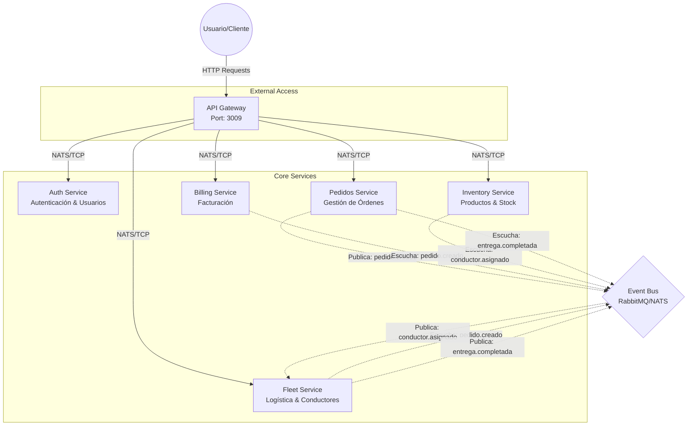

# Arquitectura de Microservicios LogiFlow

Este documento presenta una visión general de la arquitectura del sistema, detallando los microservicios, sus responsabilidades y los mecanismos de comunicación.

## Diagrama de Arquitectura Global

## Descripción de Servicios

### 1. API Gateway (`apps/api-gateway`)
-   **Rol**: Punto de entrada único para el sistema.
-   **Responsabilidades**:
    -   Enrutamiento de peticiones HTTP a microservicios.
    -   Autenticación (Guards) usando `Auth Service`.
    -   Validación básica de payloads.
-   **Tecnología**: NestJS, `ClientProxy`.

### 2. Auth Service (`apps/auth-services`)
-   **Rol**: Gestión de identidades.
-   **Responsabilidades**:
    -   Registro y Login de usuarios.
    -   Gestión de sesiones (Better Auth).
    -   Validación de tokens.
-   **Endpoints Clave**: `/api/auth/*`.

### 3. Pedidos Service (`apps/pedidos-service`)
-   **Rol**: Core de negocio de ventas.
-   **Responsabilidades**:
    -   Creación y validación de pedidos.
    -   Gestión del ciclo de vida (PENDIENTE -> ASIGNADO -> ENTREGADO).
    -   Confirmación manual de pedidos.
-   **Eventos Clave**: `pedido.creado`, `pedido.confirmado`.

### 4. Inventory Service (`apps/inventory-service`)
-   **Rol**: Gestión de stock y catálogo.
-   **Responsabilidades**:
    -   Reserva de productos (Locking).
    -   Confirmación de consumo de stock (al entregar).
    -   Validación de disponibilidad.
-   **Eventos Clave**: Escucha `pedido.creado` (Reserva), `pedido.cancelado` (Libera).

### 5. Fleet Service (`apps/fleet-service`)
-   **Rol**: Gestión logística.
-   **Responsabilidades**:
    -   Administración de vehículos y conductores.
    -   Asignación automática de conductores a pedidos.
    -   Seguimiento de entregas.
-   **Eventos Clave**: Publica `conductor.asignado`, `entrega.completada`.

### 6. Billing Service (`apps/billing-service`)
-   **Rol**: Facturación y finanzas.
-   **Responsabilidades**:
    -   Generación de facturas (Borrador -> Emitida).
    -   Cálculo de impuestos y totales.
-   **Eventos Clave**: Escucha `pedido.confirmado`, `entrega.completada`.
