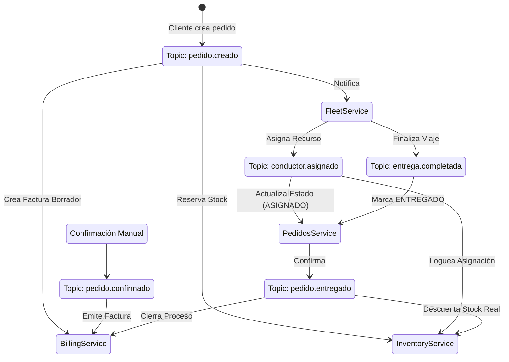

# Coreografía de Eventos

Este documento detalla el diccionario de eventos estandarizado y el flujo de comunicación asíncrona entre los microservicios.

## Diccionario de Eventos

La arquitectura utiliza un modelo de **Event Choreography**, donde cada servicio reacciona a eventos de dominio sin un orquestador central rígido.

| Evento (Topic) | Publicador | Consumidores | Descripción | Trigger |
| :--- | :--- | :--- | :--- | :--- |
| `pedido.creado` | **Pedidos** | Fleet, Billing | Se ha creado un nuevo pedido pendiente. | `POST /pedidos` |
| `pedido.confirmado` | **Pedidos** | Billing | El pedido ha sido confirmado (pago/manual). | `POST /pedidos/:id/confirmar` |
| `pedido.cancelado` | **Pedidos** | Inventory, Billing | El pedido fue cancelado. | `PATCH /pedidos/:id/cancelar` |
| `stock.insuficiente` | **Inventory** | Pedidos | No hay stock para completar la reserva. | Validación interna en Inventory |
| `conductor.asignado` | **Fleet** | Inventory, Pedidos | Se asoció un conductor al pedido. | Lógica de asignación en Fleet |
| `entrega.completada` | **Fleet** | Pedidos, Billing | El conductor marcó la entrega. | `POST /flota/asignaciones/finalizar` |
| `pedido.entregado` | **Pedidos** | Inventory | Confirmación final de estado. | Reacción a `entrega.completada` |

## Diagrama de Flujo de Eventos (Event Storming)



## Estructura de Payloads (Ejemplos)

### `pedido.creado`
```json
{
  "pedidoId": "uuid",
  "clienteId": "uuid",
  "items": [
    { "productoId": "PROD-001", "cantidad": 2 }
  ],
  "destino": { "lat": -0.1, "lng": -78.5 }
}
```

### `conductor.asignado`
```json
{
  "eventName": "conductor.asignado",
  "timestamp": "ISO-8601",
  "data": {
    "pedidoId": "uuid",
    "conductorId": "uuid-repartidor",
    "tiempoEstimadoMin": 15
  }
}
```
