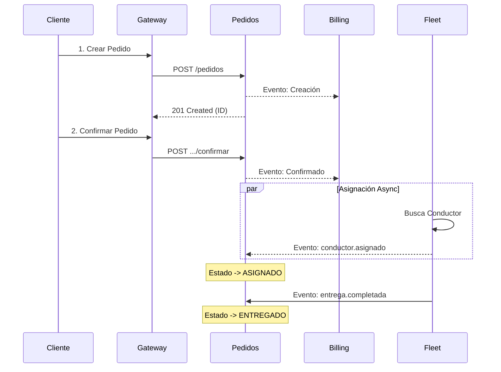

# Ciclo de Vida del Pedido (Data Flow)

Documentación del flujo paso a paso de un pedido, desde la perspectiva del usuario y de los datos.

## Guía Paso a Paso

### 1. Creación (`PENDIENTE`)
El usuario envía la solicitud de compra.
-   **Endpoint**: `POST /pedidos`
-   **Body**:
    ```json
    {
      "items": [{"productoId": "PROD-001", "cantidad": 1}],
      "destino": {"lat": 1.2, "lng": 3.4, "direccion": "Casa"}
    }
    ```
-   **Resultado**: Se crea el pedido en `Pedidos DB`. Se crea una factura borrador en `Billing DB`. Se reserva stock en `Inventory DB`.

### 2. Confirmación
El usuario o el sistema de pagos confirma la transacción.
-   **Endpoint**: `POST /pedidos/:id/confirmar`
-   **Acción**:
    -   Valida que el estatus sea `PENDIENTE`.
    -   Simula el cobro.
    -   Emite `pedido.confirmado`.
-   **Efecto**: La factura en `Billing` pasa a estado `EMITIDA/PAGADA` (según lógica).

### 3. Asignación Logística (`ASIGNADO`)
Proceso asíncrono automático (Fleet Service).
-   **Trigger**: `pedido.creado` (Opcional: `pedido.confirmado` si se cambia la regla de negocio).
-   **Acción**: Algoritmo busca conductor cercano.
-   **Efecto**: `pedidos-service` recibe `conductor.asignado` y cambia el estado a `ASIGNADO`. El cliente puede ver el ID del conductor.

### 4. Entrega (`ENTREGADO`)
El conductor finaliza la entrega.
-   **Trigger**: Acción del conductor (App Móvil / Endpoint Simulado).
-   **Endpoint**: `POST /flota/asignaciones/finalizar` (Idealmente).
-   **Efecto**:
    -   `pedidos-service` pasa a `ENTREGADO`.
    -   `inventory-service` confirma la salida de mercancía.
    -   `billing-service` registra la entrega para auditoría.

## Diagrama de Secuencia


